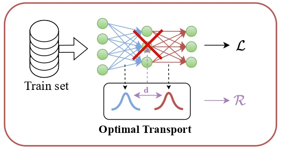

<div align="center">
  <div>
  <h1>LaCoOT: Layer Collapse through Optimal Transport</h1> 

[](https://arxiv.org/pdf/2406.08933)
[](https://openaccess.thecvf.com/content/ICCV2025/papers/Quetu_LaCoOT_Layer_Collapse_through_Optimal_Transport_ICCV_2025_paper.pdf)

  </div>

</div>

<div align="center">

<div>
    <a href='https://vgcq.github.io/' target='_blank'>Victor Quétu</a><sup>1</sup>&emsp;
    <a href='https://scholar.google.com/citations?user=xjwYZvIAAAAJ&hl=en' target='_blank'>Zhu Liao</a><sup>1</sup>&emsp;
    <a href='' target='_blank'>Nour Hezbri</a><sup>2</sup>&emsp;
    <a href='https://fabvio.github.io/' target='_blank'>Fabio Pizzati</a><sup>3</sup>&emsp;
    <a href='https://enzotarta.github.io/' target='_blank'>Enzo Tartaglione</a><sup>1</sup>&emsp;  
</div>
<div>
<sup>1</sup>LTCI, Télécom Paris, Institut Polytechnique de Paris&emsp;  
<sup>2</sup>ENSAE, Institut Polytechnique de Paris&emsp;  
<sup>3</sup>MBZUAI&emsp;  

</div>
</div> <br>

📣 Published as a conference paper at ICCV 2025.  <br>

This repository implements the key experiments of the following paper: [LaCoOT: Layer Collapse through Optimal Transport](https://openaccess.thecvf.com/content/ICCV2025/papers/Quetu_LaCoOT_Layer_Collapse_through_Optimal_Transport_ICCV_2025_paper.pdf), and more particularly of our method LaCoOT, reducing neural network depth using optimal transport.

<p align="center">
  
</p>

## Usage

In practice, you can begin with a set of defaults and optionally modify individual hyperparameters as desired. To view the hyperparameters for each subcommand, use the following command. 
```
python main.py [subcommand] [...] --help
```

## Checkpoints

MobileNetv2 trained on CIFAR-10 with LaCoOT with $\lambda=9$ is available in the [checkpoints](./checkpoints/) folder.
ResNet-18 and Swin-T trained on CIFAR-10 are open-sourced and can be downloaded from Google Drive:
- [ResNet-18 checkpoint](https://drive.google.com/file/d/1-qZmrjahNNIKetAl_9C49ZC6FPFRcVGq/view?usp=drive_link)
- [Swin-T checkpoint](https://drive.google.com/file/d/1PU9r9xKpumcWacvq6FUkp5xfigSIPcDX/view?usp=drive_link)

## Example Runs

### Training
To train a ResNet-18 on CIFAR-10 with LaCoOT, optimized with SGD for 160 epochs, momentum of 0.9, batch size of 128, learning rate 0.1, milestones 80 and 120, drop factor of 0.1 weight decay 1e-4 and $\lambda=5$:

```python main.py --root YOUR_PATH_TO_CIFAR --dir_to_save_checkpoint YOUR_PATH_TO_CHECKPOINTS --lambda_reg 5```

To train a Swin-T on Tiny-ImageNet-200 with LaCoOT, optimized with SGD for 160 epochs with a learning rate of 1e-3, batch size of 128, milestones 80 and 120, drop factor of 0.1, weight decay 1e-4 and $\lambda=1$:

```python main.py --root YOUR_PATH_TO_TINY-IMAGENET-200 --dir_to_save_checkpoint YOUR_PATH_TO_CHECKPOINTS --model Swin-T --dataset Tiny-ImageNet-200 --optimizer SGD --epochs 160 --lr 1e-3 --batch_size 128 --gamma 0.1 --wd 1e-4 --lambda_reg 1```

### Checking layer removability
To check the removability of your ResNet-18 trained on CIFAR-10 with LaCoOT :
```python main.py --name_checkpoint checkpoints/checkpoint_CIFAR-10_ResNet-18_lambda_5.0_last_epoch.pt --root YOUR_PATH_TO_CIFAR```

To check the removability of your Swin-T trained on CIFAR-10 with LaCoOT :
```python main.py --name_checkpoint checkpoints/checkpoint_CIFAR-10_Swin-T_lambda_0.1_last_epoch.pt --root YOUR_PATH_TO_CIFAR --model Swin-T```
(Do not forget to save the statistics of the Wasserstein Distance per block of your model in the csv folder)

## Citation
If you find this useful for your research, please cite the following paper.
```
@inproceedings{quetu2025lacoot,
  title={LaCoOT: Layer collapse through optimal transport},
  author={Qu{\'e}tu, Victor and Liao, Zhu and Hezbri, Nour and Pizzati, Fabio and Tartaglione, Enzo},
  booktitle={Proceedings of the IEEE/CVF International Conference on Computer Vision},
  pages={20497--20507},
  year={2025}
}
```
